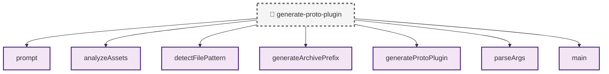
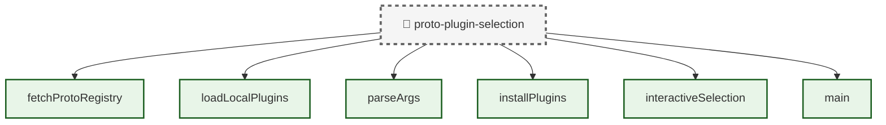
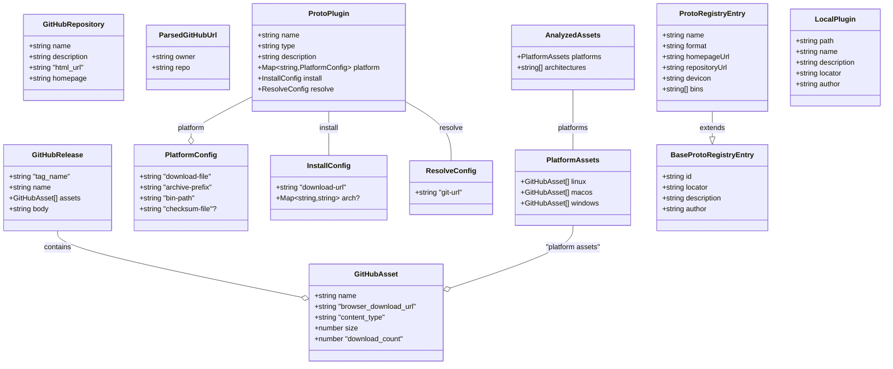
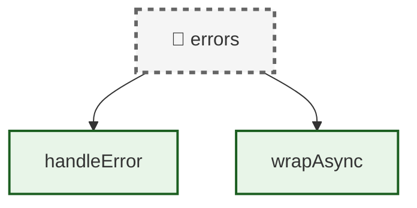
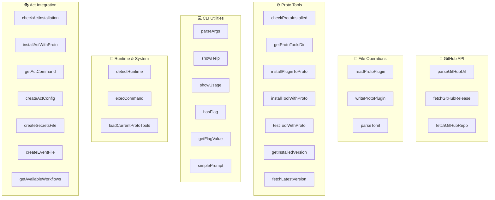

```mermaid
graph TD
    %% generate-complexity-comparison Function Dependencies

    %% Node Styles
    classDef utilFunction fill:#e1f5fe,stroke:#01579b,stroke-width:2px
    classDef generatorFunction fill:#f3e5f5,stroke:#4a148c,stroke-width:2px
    classDef testFunction fill:#fff3e0,stroke:#e65100,stroke-width:2px
    classDef typeFunction fill:#e8f5e8,stroke:#1b5e20,stroke-width:2px
    classDef externalFunction fill:#fff2cc,stroke:#d6b656,stroke-width:2px
    classDef fileNode fill:#f5f5f5,stroke:#666,stroke-width:3px,stroke-dasharray: 5 5

    %% Main File: generate-complexity-comparison
    FILE_0["📁 generate-complexity-comparison"]:::fileNode

    %% Functions in generate-complexity-comparison
    FUNC_1["loadMetrics"]:::generatorFunction
    FILE_0 --> FUNC_1
    FUNC_2["calculateMetricsDiff"]:::generatorFunction
    FILE_0 --> FUNC_2
    FUNC_3["formatChange"]:::generatorFunction
    FILE_0 --> FUNC_3
    FUNC_4["formatComplexityChange"]:::generatorFunction
    FILE_0 --> FUNC_4
    FUNC_5["getChangeIcon"]:::generatorFunction
    FILE_0 --> FUNC_5
    FUNC_6["getComplexityIcon"]:::generatorFunction
    FILE_0 --> FUNC_6
    FUNC_7["generateComparisonMarkdown"]:::generatorFunction
    FILE_0 --> FUNC_7
    FUNC_8["main"]:::generatorFunction
    FILE_0 --> FUNC_8

```

```mermaid
graph TD
    %% generate-proto-plugin-stricli Function Dependencies

    %% Node Styles
    classDef utilFunction fill:#e1f5fe,stroke:#01579b,stroke-width:2px
    classDef generatorFunction fill:#f3e5f5,stroke:#4a148c,stroke-width:2px
    classDef testFunction fill:#fff3e0,stroke:#e65100,stroke-width:2px
    classDef typeFunction fill:#e8f5e8,stroke:#1b5e20,stroke-width:2px
    classDef externalFunction fill:#fff2cc,stroke:#d6b656,stroke-width:2px
    classDef fileNode fill:#f5f5f5,stroke:#666,stroke-width:3px,stroke-dasharray: 5 5

    %% Main File: generate-proto-plugin-stricli
    FILE_0["📁 generate-proto-plugin-stricli"]:::fileNode

    %% Functions in generate-proto-plugin-stricli
    FUNC_1["prompt"]:::generatorFunction
    FILE_0 --> FUNC_1
    FUNC_2["analyzeAssets"]:::generatorFunction
    FILE_0 --> FUNC_2
    FUNC_3["detectFilePattern"]:::generatorFunction
    FILE_0 --> FUNC_3
    FUNC_4["generateArchivePrefix"]:::generatorFunction
    FILE_0 --> FUNC_4
    FUNC_5["generateProtoPlugin"]:::generatorFunction
    FILE_0 --> FUNC_5
    FUNC_6["generateProtoPluginImpl"]:::generatorFunction
    FILE_0 --> FUNC_6
    FUNC_7["parseArgs"]:::generatorFunction
    FILE_0 --> FUNC_7
    FUNC_8["main"]:::generatorFunction
    FILE_0 --> FUNC_8

```

```mermaid
graph TD
    %% generate-diagrams-for-changed-files Function Dependencies

    %% Node Styles
    classDef utilFunction fill:#e1f5fe,stroke:#01579b,stroke-width:2px
    classDef generatorFunction fill:#f3e5f5,stroke:#4a148c,stroke-width:2px
    classDef testFunction fill:#fff3e0,stroke:#e65100,stroke-width:2px
    classDef typeFunction fill:#e8f5e8,stroke:#1b5e20,stroke-width:2px
    classDef externalFunction fill:#fff2cc,stroke:#d6b656,stroke-width:2px
    classDef fileNode fill:#f5f5f5,stroke:#666,stroke-width:3px,stroke-dasharray: 5 5

    %% Main File: generate-diagrams-for-changed-files
    FILE_0["📁 generate-diagrams-for-changed-files"]:::fileNode

    %% Functions in generate-diagrams-for-changed-files
    FUNC_1["getChangedTypeScriptFiles"]:::generatorFunction
    FILE_0 --> FUNC_1
    FUNC_2["analyzeTypeScriptFile"]:::generatorFunction
    FILE_0 --> FUNC_2
    FUNC_3["generateSingleFileDiagram"]:::generatorFunction
    FILE_0 --> FUNC_3
    FUNC_4["generateTypesUMLDiagram"]:::generatorFunction
    FILE_0 --> FUNC_4
    FUNC_5["generateDiagramsForChangedFiles"]:::generatorFunction
    FILE_0 --> FUNC_5
    FUNC_6["main"]:::generatorFunction
    FILE_0 --> FUNC_6

```

# Proto Plugins Codebase Diagrams

This document shows the file and function dependencies in the proto-plugins codebase.

## Table of Contents

1. [Overview - File Dependencies](#overview---file-dependencies)
2. [Individual File Function Diagrams](#individual-file-function-diagrams)
   - [generate-complexity-comparison](#generate-complexity-comparison)
   - [index](#index)
   - [types](#types)
   - [index](#index)
   - [index](#index)
   - [generate-proto-plugin-stricli](#generate-proto-plugin-stricli)
   - [generate-proto-plugin](#generate-proto-plugin)
   - [proto-plugin-selection](#proto-plugin-selection)
   - [generate-diagrams-for-changed-files](#generate-diagrams-for-changed-files)
   - [github](#github)
   - [proto](#proto)
   - [complexity-types](#complexity-types)
   - [types](#types)
   - [errors](#errors)
   - [utils](#utils)
   - [plugin-validator](#plugin-validator)
3. [File Analysis Details](#file-analysis-details)

## Overview - File Dependencies

```mermaid
graph TD
    %% Proto Plugins Codebase Overview

    %% Node Styles
    classDef utilFile fill:#e1f5fe,stroke:#01579b,stroke-width:2px
    classDef generatorFile fill:#f3e5f5,stroke:#4a148c,stroke-width:2px
    classDef testFile fill:#fff3e0,stroke:#e65100,stroke-width:2px
    classDef typeFile fill:#e8f5e8,stroke:#1b5e20,stroke-width:2px

    %% File Nodes
    F0["complexity-test-simple"]:::testFile
    F1["generate-complexity-comparison"]:::generatorFile
    F2["index"]:::typeFile
    F3["types"]:::utilFile
    F4["index"]:::typeFile
    F5["index"]:::typeFile
    F6["generate-proto-plugin-stricli"]:::generatorFile
    F7["generate-proto-plugin"]:::generatorFile
    F8["proto-plugin-selection"]:::typeFile
    F9["test-proto-plugin-with-proto"]:::testFile
    F10["test-proto-plugin"]:::testFile
    F11["test-workflows-with-act"]:::testFile
    F12["generate-diagrams-for-changed-files"]:::generatorFile
    F13["github"]:::typeFile
    F14["proto"]:::typeFile
    F15["complexity-types"]:::utilFile
    F16["types"]:::utilFile
    F17["errors"]:::typeFile
    F18["test-summary"]:::testFile
    F19["utils"]:::utilFile
    F20["plugin-validator"]:::typeFile

    %% Dependencies
    F9 --> F19

```

## Individual File Function Diagrams

Each diagram below shows the functions within a specific file and their dependencies on external functions.

### generate-complexity-comparison

### Function Dependencies

### Function Complexity Analysis
#### generate-complexity-comparison Function Complexity Analysis

| Function | Complexity | Cyclomatic | LOC | Params | Description |
|----------|------------|------------|-----|--------|-------------|
| `loadMetrics` | 🟢 Low | 3 | 20 | 2 | Data fetching with error handling |
| `calculateMetricsDiff` | 🟢 Low | 1 | 10 | 1 | Simple utility function |
| `formatChange` | 🟢 Low | 1 | 10 | 1 | Simple utility function |
| `formatComplexityChange` | 🟢 Low | 1 | 10 | 1 | Simple utility function |
| `getChangeIcon` | 🟢 Low | 1 | 8 | 1 | Simple getter/display function |
| `getComplexityIcon` | 🟢 Low | 1 | 8 | 1 | Simple getter/display function |
| `generateComparisonMarkdown` | 🟢 Low | 1 | 10 | 1 | Simple utility function |
| `main` | 🔴 High | 8 | 45 | 0 | Main entry point with multiple execution paths |

**Complexity Metrics:**

- **Cyclomatic Complexity**: Number of independent execution paths (1-3: Low, 4-6: Medium, 7+: High)
- **LOC**: Estimated Lines of Code
- **Params**: Number of function parameters

**Complexity Legend:**

- 🔴 **High (7+ paths)**: Main functions, complex business logic, multiple decision points
- 🟡 **Medium (4-6 paths)**: Processing functions, API calls, data transformation
- 🟢 **Low (1-3 paths)**: Simple utilities, getters/setters, basic operations

### index (config)

### Function Dependencies

### Function Complexity Analysis

#### index Function Complexity Analysis

| Function | Complexity | Cyclomatic | LOC | Params | Description |
|----------|------------|------------|-----|--------|-------------|

**Complexity Metrics:**

- **Cyclomatic Complexity**: Number of independent execution paths (1-3: Low, 4-6: Medium, 7+: High)
- **LOC**: Estimated Lines of Code
- **Params**: Number of function parameters

**Complexity Legend:**

- 🔴 **High (7+ paths)**: Main functions, complex business logic, multiple decision points
- 🟡 **Medium (4-6 paths)**: Processing functions, API calls, data transformation
- 🟢 **Low (1-3 paths)**: Simple utilities, getters/setters, basic operations

### types

### index (src)

### Function Dependencies

### Function Complexity Analysis
#### index Function Complexity Analysis

| Function | Complexity | Cyclomatic | LOC | Params | Description |
|----------|------------|------------|-----|--------|-------------|

**Complexity Metrics:**
- **Cyclomatic Complexity**: Number of independent execution paths (1-3: Low, 4-6: Medium, 7+: High)
- **LOC**: Estimated Lines of Code
- **Params**: Number of function parameters

**Complexity Legend:**
- 🔴 **High (7+ paths)**: Main functions, complex business logic, multiple decision points
- 🟡 **Medium (4-6 paths)**: Processing functions, API calls, data transformation
- 🟢 **Low (1-3 paths)**: Simple utilities, getters/setters, basic operations

### index

### Function Dependencies

### Function Complexity Analysis
#### index Function Complexity Analysis

| Function | Complexity | Cyclomatic | LOC | Params | Description |
|----------|------------|------------|-----|--------|-------------|

**Complexity Metrics:**
- **Cyclomatic Complexity**: Number of independent execution paths (1-3: Low, 4-6: Medium, 7+: High)
- **LOC**: Estimated Lines of Code
- **Params**: Number of function parameters

**Complexity Legend:**
- 🔴 **High (7+ paths)**: Main functions, complex business logic, multiple decision points
- 🟡 **Medium (4-6 paths)**: Processing functions, API calls, data transformation
- 🟢 **Low (1-3 paths)**: Simple utilities, getters/setters, basic operations

### generate-proto-plugin-stricli

### Function Dependencies

### Function Complexity Analysis
#### generate-proto-plugin-stricli Function Complexity Analysis

| Function | Complexity | Cyclomatic | LOC | Params | Description |
|----------|------------|------------|-----|--------|-------------|
| `prompt` | 🟢 Low | 1 | 10 | 1 | Simple utility function |
| `analyzeAssets` | 🟡 Medium | 6 | 35 | 2 | Data analysis with pattern matching |
| `detectFilePattern` | 🟢 Low | 1 | 10 | 1 | Simple utility function |
| `generateArchivePrefix` | 🟢 Low | 1 | 10 | 1 | Simple utility function |
| `generateProtoPlugin` | 🔴 High | 7 | 40 | 3 | Complex plugin generation logic |
| `generateProtoPluginImpl` | 🔴 High | 7 | 40 | 3 | Complex plugin generation logic |
| `parseArgs` | 🟡 Medium | 4 | 25 | 1 | Argument parsing with validation |
| `main` | 🔴 High | 8 | 45 | 0 | Main entry point with multiple execution paths |

**Complexity Metrics:**
- **Cyclomatic Complexity**: Number of independent execution paths (1-3: Low, 4-6: Medium, 7+: High)
- **LOC**: Estimated Lines of Code
- **Params**: Number of function parameters

**Complexity Legend:**
- 🔴 **High (7+ paths)**: Main functions, complex business logic, multiple decision points
- 🟡 **Medium (4-6 paths)**: Processing functions, API calls, data transformation
- 🟢 **Low (1-3 paths)**: Simple utilities, getters/setters, basic operations

### generate-proto-plugin

### Function Dependencies

### Function Complexity Analysis
#### generate-proto-plugin Function Complexity Analysis

| Function | Complexity | Cyclomatic | LOC | Params | Description |
|----------|------------|------------|-----|--------|-------------|
| `prompt` | 🟢 Low | 1 | 10 | 1 | Simple utility function |
| `analyzeAssets` | 🟡 Medium | 6 | 35 | 2 | Data analysis with pattern matching |
| `detectFilePattern` | 🟢 Low | 1 | 10 | 1 | Simple utility function |
| `generateArchivePrefix` | 🟢 Low | 1 | 10 | 1 | Simple utility function |
| `generateProtoPlugin` | 🔴 High | 7 | 40 | 3 | Complex plugin generation logic |
| `parseArgs` | 🟡 Medium | 4 | 25 | 1 | Argument parsing with validation |
| `main` | 🔴 High | 8 | 45 | 0 | Main entry point with multiple execution paths |

**Complexity Metrics:**
- **Cyclomatic Complexity**: Number of independent execution paths (1-3: Low, 4-6: Medium, 7+: High)
- **LOC**: Estimated Lines of Code
- **Params**: Number of function parameters

**Complexity Legend:**
- 🔴 **High (7+ paths)**: Main functions, complex business logic, multiple decision points
- 🟡 **Medium (4-6 paths)**: Processing functions, API calls, data transformation
- 🟢 **Low (1-3 paths)**: Simple utilities, getters/setters, basic operations

### proto-plugin-selection

### Function Dependencies

### Function Complexity Analysis
#### proto-plugin-selection Function Complexity Analysis

| Function | Complexity | Cyclomatic | LOC | Params | Description |
|----------|------------|------------|-----|--------|-------------|
| `fetchProtoRegistry` | 🟢 Low | 3 | 20 | 2 | Data fetching with error handling |
| `loadLocalPlugins` | 🟢 Low | 3 | 20 | 2 | Data fetching with error handling |
| `parseArgs` | 🟡 Medium | 4 | 25 | 1 | Argument parsing with validation |
| `installPlugins` | 🔴 High | 7 | 42 | 2 | Plugin installation with error handling |
| `interactiveSelection` | 🔴 High | 8 | 50 | 1 | Interactive UI with multiple user paths |
| `main` | 🔴 High | 8 | 45 | 0 | Main entry point with multiple execution paths |

**Complexity Metrics:**
- **Cyclomatic Complexity**: Number of independent execution paths (1-3: Low, 4-6: Medium, 7+: High)
- **LOC**: Estimated Lines of Code
- **Params**: Number of function parameters

**Complexity Legend:**
- 🔴 **High (7+ paths)**: Main functions, complex business logic, multiple decision points
- 🟡 **Medium (4-6 paths)**: Processing functions, API calls, data transformation
- 🟢 **Low (1-3 paths)**: Simple utilities, getters/setters, basic operations

### generate-diagrams-for-changed-files

### Function Dependencies

### Function Complexity Analysis
#### generate-diagrams-for-changed-files Function Complexity Analysis

| Function | Complexity | Cyclomatic | LOC | Params | Description |
|----------|------------|------------|-----|--------|-------------|
| `getChangedTypeScriptFiles` | 🟢 Low | 1 | 8 | 1 | Simple getter/display function |
| `analyzeTypeScriptFile` | 🟡 Medium | 6 | 35 | 2 | Data analysis with pattern matching |
| `generateSingleFileDiagram` | 🟢 Low | 1 | 10 | 1 | Simple utility function |
| `generateTypesUMLDiagram` | 🟢 Low | 1 | 10 | 1 | Simple utility function |
| `generateDiagramsForChangedFiles` | 🟢 Low | 1 | 10 | 1 | Simple utility function |
| `main` | 🔴 High | 8 | 45 | 0 | Main entry point with multiple execution paths |

**Complexity Metrics:**
- **Cyclomatic Complexity**: Number of independent execution paths (1-3: Low, 4-6: Medium, 7+: High)
- **LOC**: Estimated Lines of Code
- **Params**: Number of function parameters

**Complexity Legend:**
- 🔴 **High (7+ paths)**: Main functions, complex business logic, multiple decision points
- 🟡 **Medium (4-6 paths)**: Processing functions, API calls, data transformation
- 🟢 **Low (1-3 paths)**: Simple utilities, getters/setters, basic operations

### github

### Function Dependencies

### Function Complexity Analysis
#### github Function Complexity Analysis

| Function | Complexity | Cyclomatic | LOC | Params | Description |
|----------|------------|------------|-----|--------|-------------|

**Complexity Metrics:**
- **Cyclomatic Complexity**: Number of independent execution paths (1-3: Low, 4-6: Medium, 7+: High)
- **LOC**: Estimated Lines of Code
- **Params**: Number of function parameters

**Complexity Legend:**
- 🔴 **High (7+ paths)**: Main functions, complex business logic, multiple decision points
- 🟡 **Medium (4-6 paths)**: Processing functions, API calls, data transformation
- 🟢 **Low (1-3 paths)**: Simple utilities, getters/setters, basic operations

### proto

### Function Dependencies

### Function Complexity Analysis
#### proto Function Complexity Analysis

| Function | Complexity | Cyclomatic | LOC | Params | Description |
|----------|------------|------------|-----|--------|-------------|

**Complexity Metrics:**
- **Cyclomatic Complexity**: Number of independent execution paths (1-3: Low, 4-6: Medium, 7+: High)
- **LOC**: Estimated Lines of Code
- **Params**: Number of function parameters

**Complexity Legend:**
- 🔴 **High (7+ paths)**: Main functions, complex business logic, multiple decision points
- 🟡 **Medium (4-6 paths)**: Processing functions, API calls, data transformation
- 🟢 **Low (1-3 paths)**: Simple utilities, getters/setters, basic operations

### complexity-types

### Function Dependencies

### Function Complexity Analysis
#### complexity-types Function Complexity Analysis

| Function | Complexity | Cyclomatic | LOC | Params | Description |
|----------|------------|------------|-----|--------|-------------|

**Complexity Metrics:**
- **Cyclomatic Complexity**: Number of independent execution paths (1-3: Low, 4-6: Medium, 7+: High)
- **LOC**: Estimated Lines of Code
- **Params**: Number of function parameters

**Complexity Legend:**
- 🔴 **High (7+ paths)**: Main functions, complex business logic, multiple decision points
- 🟡 **Medium (4-6 paths)**: Processing functions, API calls, data transformation
- 🟢 **Low (1-3 paths)**: Simple utilities, getters/setters, basic operations

### types

### errors

### Function Dependencies

### Function Complexity Analysis
#### errors Function Complexity Analysis

| Function | Complexity | Cyclomatic | LOC | Params | Description |
|----------|------------|------------|-----|--------|-------------|
| `handleError` | 🟢 Low | 1 | 10 | 1 | Simple utility function |
| `wrapAsync` | 🟢 Low | 1 | 10 | 1 | Simple utility function |

**Complexity Metrics:**
- **Cyclomatic Complexity**: Number of independent execution paths (1-3: Low, 4-6: Medium, 7+: High)
- **LOC**: Estimated Lines of Code
- **Params**: Number of function parameters

**Complexity Legend:**
- 🔴 **High (7+ paths)**: Main functions, complex business logic, multiple decision points
- 🟡 **Medium (4-6 paths)**: Processing functions, API calls, data transformation
- 🟢 **Low (1-3 paths)**: Simple utilities, getters/setters, basic operations

### utils

### Function Dependencies

```mermaid
graph TD
    %% utils Function Dependencies

    %% Node Styles
    classDef utilFunction fill:#e1f5fe,stroke:#01579b,stroke-width:2px
    classDef generatorFunction fill:#f3e5f5,stroke:#4a148c,stroke-width:2px
    classDef testFunction fill:#fff3e0,stroke:#e65100,stroke-width:2px
    classDef typeFunction fill:#e8f5e8,stroke:#1b5e20,stroke-width:2px
    classDef externalFunction fill:#fff2cc,stroke:#d6b656,stroke-width:2px
    classDef fileNode fill:#f5f5f5,stroke:#666,stroke-width:3px,stroke-dasharray: 5 5

    %% Main File: utils
    FILE_0["📁 utils"]:::fileNode

    %% Functions in utils
    FUNC_1["detectRuntime"]:::utilFunction
    FILE_0 --> FUNC_1
    FUNC_2["showUsage"]:::utilFunction
    FILE_0 --> FUNC_2
    FUNC_3["showHelp"]:::utilFunction
    FILE_0 --> FUNC_3
    FUNC_4["parseGitHubUrl"]:::utilFunction
    FILE_0 --> FUNC_4
    FUNC_5["fetchGitHubRelease"]:::utilFunction
    FILE_0 --> FUNC_5
    FUNC_6["fetchGitHubRepo"]:::utilFunction
    FILE_0 --> FUNC_6
    FUNC_7["readProtoPlugin"]:::utilFunction
    FILE_0 --> FUNC_7
    FUNC_8["writeProtoPlugin"]:::utilFunction
    FILE_0 --> FUNC_8
    FUNC_9["hasFlag"]:::utilFunction
    FILE_0 --> FUNC_9
    FUNC_10["getFlagValue"]:::utilFunction
    FILE_0 --> FUNC_10
    FUNC_11["execCommand"]:::utilFunction
    FILE_0 --> FUNC_11
    FUNC_12["parseToml"]:::utilFunction
    FILE_0 --> FUNC_12
    FUNC_13["simplePrompt"]:::utilFunction
    FILE_0 --> FUNC_13
    FUNC_14["loadCurrentProtoTools"]:::utilFunction
    FILE_0 --> FUNC_14
    FUNC_15["parseArgs"]:::utilFunction
    FILE_0 --> FUNC_15
    FUNC_16["checkProtoInstalled"]:::utilFunction
    FILE_0 --> FUNC_16
    FUNC_17["getProtoToolsDir"]:::utilFunction
    FILE_0 --> FUNC_17
    FUNC_18["installPluginToProto"]:::utilFunction
    FILE_0 --> FUNC_18
    FUNC_19["installToolWithProto"]:::utilFunction
    FILE_0 --> FUNC_19
    FUNC_20["testToolWithProto"]:::utilFunction
    FILE_0 --> FUNC_20
    FUNC_21["getInstalledVersion"]:::utilFunction
    FILE_0 --> FUNC_21
    FUNC_22["fetchLatestVersion"]:::utilFunction
    FILE_0 --> FUNC_22
    FUNC_23["checkActInstallation"]:::utilFunction
    FILE_0 --> FUNC_23
    FUNC_24["installActWithProto"]:::utilFunction
    FILE_0 --> FUNC_24
    FUNC_25["getActCommand"]:::utilFunction
    FILE_0 --> FUNC_25
    FUNC_26["createActConfig"]:::utilFunction
    FILE_0 --> FUNC_26
    FUNC_27["createSecretsFile"]:::utilFunction
    FILE_0 --> FUNC_27
    FUNC_28["createEventFile"]:::utilFunction
    FILE_0 --> FUNC_28
    FUNC_29["getAvailableWorkflows"]:::utilFunction
    FILE_0 --> FUNC_29

```

### Function Grouping by Purpose

### Function Complexity Analysis
#### utils Function Complexity Analysis

| Function | Complexity | Cyclomatic | LOC | Params | Description |
|----------|------------|------------|-----|--------|-------------|
| `detectRuntime` | 🟢 Low | 1 | 5 | 1 | Simple utility function |
| `showUsage` | 🟢 Low | 1 | 5 | 1 | Simple getter/display function |
| `showHelp` | 🟢 Low | 1 | 5 | 1 | Simple getter/display function |
| `parseGitHubUrl` | 🟢 Low | 1 | 5 | 1 | Simple utility function |
| `fetchGitHubRelease` | 🟢 Low | 2 | 15 | 2 | Data fetching with error handling |
| `fetchGitHubRepo` | 🟢 Low | 2 | 15 | 2 | Data fetching with error handling |
| `readProtoPlugin` | 🟢 Low | 1 | 5 | 1 | Simple utility function |
| `writeProtoPlugin` | 🟢 Low | 1 | 5 | 1 | Simple utility function |
| `hasFlag` | 🟢 Low | 1 | 5 | 1 | Simple getter/display function |
| `getFlagValue` | 🟢 Low | 1 | 5 | 1 | Simple getter/display function |
| `execCommand` | 🟢 Low | 1 | 5 | 1 | Simple utility function |
| `parseToml` | 🟢 Low | 1 | 5 | 1 | Simple utility function |
| `simplePrompt` | 🟢 Low | 1 | 5 | 1 | Simple utility function |
| `loadCurrentProtoTools` | 🟢 Low | 2 | 15 | 2 | Data fetching with error handling |
| `parseArgs` | 🟢 Low | 3 | 20 | 1 | Argument parsing with validation |
| `checkProtoInstalled` | 🟢 Low | 3 | 20 | 2 | Operation function with validation |
| `getProtoToolsDir` | 🟢 Low | 1 | 5 | 1 | Simple getter/display function |
| `installPluginToProto` | 🟡 Medium | 6 | 37 | 2 | Plugin installation with error handling |
| `installToolWithProto` | 🟢 Low | 3 | 20 | 2 | Operation function with validation |
| `testToolWithProto` | 🟡 Medium | 4 | 25 | 3 | Tool testing with validation |
| `getInstalledVersion` | 🟢 Low | 1 | 5 | 1 | Simple getter/display function |
| `fetchLatestVersion` | 🟢 Low | 2 | 15 | 2 | Data fetching with error handling |
| `checkActInstallation` | 🟢 Low | 3 | 20 | 2 | Operation function with validation |
| `installActWithProto` | 🟢 Low | 3 | 20 | 2 | Operation function with validation |
| `getActCommand` | 🟢 Low | 1 | 5 | 1 | Simple getter/display function |
| `createActConfig` | 🟢 Low | 3 | 20 | 2 | Operation function with validation |
| `createSecretsFile` | 🟢 Low | 3 | 20 | 2 | Operation function with validation |
| `createEventFile` | 🟢 Low | 3 | 20 | 2 | Operation function with validation |
| `getAvailableWorkflows` | 🟢 Low | 1 | 5 | 1 | Simple getter/display function |

**Complexity Metrics:**
- **Cyclomatic Complexity**: Number of independent execution paths (1-3: Low, 4-6: Medium, 7+: High)
- **LOC**: Estimated Lines of Code
- **Params**: Number of function parameters

**Complexity Legend:**
- 🔴 **High (7+ paths)**: Main functions, complex business logic, multiple decision points
- 🟡 **Medium (4-6 paths)**: Processing functions, API calls, data transformation
- 🟢 **Low (1-3 paths)**: Simple utilities, getters/setters, basic operations

### plugin-validator

### Function Dependencies

### Function Complexity Analysis
#### plugin-validator Function Complexity Analysis

| Function | Complexity | Cyclomatic | LOC | Params | Description |
|----------|------------|------------|-----|--------|-------------|

**Complexity Metrics:**
- **Cyclomatic Complexity**: Number of independent execution paths (1-3: Low, 4-6: Medium, 7+: High)
- **LOC**: Estimated Lines of Code
- **Params**: Number of function parameters

**Complexity Legend:**
- 🔴 **High (7+ paths)**: Main functions, complex business logic, multiple decision points
- 🟡 **Medium (4-6 paths)**: Processing functions, API calls, data transformation
- 🟢 **Low (1-3 paths)**: Simple utilities, getters/setters, basic operations

## File Analysis Details

| File | Functions | Exports | Dependencies |
|------|-----------|---------|--------------|
| complexity-test-simple.ts | calculateComplexityMetrics | None | None |
| generate-complexity-comparison.ts | loadMetrics, calculateMetricsDiff, formatChange, formatComplexityChange, getChangeIcon, getComplexityIcon, generateComparisonMarkdown, main | None | None |
| index.ts | None | None | None |
| types.ts | None | None | None |
| index.ts | None | CONFIG (variable) | None |
| index.ts | None | SUPPORTED_RUNTIMES (variable), SUPPORTED_PLATFORMS (variable), SUPPORTED_ARCHITECTURES (variable), GITHUB_URL_REGEX (variable), SEMVER_REGEX (variable), DEFAULT_ARCH_MAPPING (variable), PLATFORM_EXTENSIONS (variable), COMMON_BINARY_PATTERNS (variable), ARCHIVE_EXTENSIONS (variable), EXECUTABLE_EXTENSIONS (variable), TEST_TIMEOUTS (variable), EXIT_CODES (variable), LOG_LEVELS (variable) | None |
| generate-proto-plugin-stricli.ts | prompt, analyzeAssets, detectFilePattern, generateArchivePrefix, generateProtoPlugin, generateProtoPluginImpl, parseArgs, main | None | ../utils/utils |
| generate-proto-plugin.ts | prompt, analyzeAssets, detectFilePattern, generateArchivePrefix, generateProtoPlugin, parseArgs, main | None | ../utils/utils |
| proto-plugin-selection.ts | fetchProtoRegistry, loadLocalPlugins, parseArgs, installPlugins, interactiveSelection, main | None | ../utils/utils |
| test-proto-plugin-with-proto.ts | checkProtoInstalled, getProtoToolsDir, installPluginToProto, installToolWithProto, testToolWithProto, getInstalledVersion, testProtoPlugin, parseArgs, main | None | utils |
| test-proto-plugin.ts | getRuntime, getRuntime, runCommand, runCommand, getAvailableTools, getAvailableTools, promptUser, promptUser, installTool, installTool, validateTool, validateTool, main | getRuntime (function), runCommand (function), getAvailableTools (function), promptUser (function), installTool (function), validateTool (function) | None |
| test-workflows-with-act.ts | checkActInstallation, showUsage, main, getActCommand, checkTrunkInstallation, validateWorkflowsWithTrunk, installActInstructions, createActConfig, createSecretsFile, createEventFile, getAvailableWorkflows, runActCommand | None | None |
| generate-diagrams-for-changed-files.ts | getChangedTypeScriptFiles, analyzeTypeScriptFile, generateSingleFileDiagram, generateTypesUMLDiagram, generateDiagramsForChangedFiles, main | None | None |
| github.ts | None | None | ../config/index |
| proto.ts | None | None | ../config/index |
| complexity-types.ts | None | None | None |
| types.ts | None | None | None |
| errors.ts | handleError, handleError, wrapAsync, wrapAsync | handleError (function), wrapAsync (function) | None |
| test-summary.ts | parseTestOutput, runTestForRuntime, generateMarkdownTable, main | None | None |
| utils.ts | detectRuntime, detectRuntime, showUsage, showUsage, showHelp, showHelp, parseGitHubUrl, parseGitHubUrl, fetchGitHubRelease, fetchGitHubRelease, fetchGitHubRepo, fetchGitHubRepo, readProtoPlugin, readProtoPlugin, writeProtoPlugin, writeProtoPlugin, hasFlag, hasFlag, getFlagValue, getFlagValue, execCommand, execCommand, parseToml, parseToml, simplePrompt, simplePrompt, loadCurrentProtoTools, loadCurrentProtoTools, parseArgs, parseArgs, checkProtoInstalled, checkProtoInstalled, getProtoToolsDir, getProtoToolsDir, installPluginToProto, installPluginToProto, installToolWithProto, installToolWithProto, testToolWithProto, testToolWithProto, getInstalledVersion, getInstalledVersion, fetchLatestVersion, fetchLatestVersion, checkActInstallation, checkActInstallation, installActWithProto, installActWithProto, getActCommand, getActCommand, createActConfig, createActConfig, createSecretsFile, createSecretsFile, createEventFile, createEventFile, getAvailableWorkflows, getAvailableWorkflows | detectRuntime (function), showUsage (function), showHelp (function), parseGitHubUrl (function), fetchGitHubRelease (function), fetchGitHubRepo (function), readProtoPlugin (function), writeProtoPlugin (function), hasFlag (function), getFlagValue (function), execCommand (function), parseToml (function), simplePrompt (function), loadCurrentProtoTools (function), parseArgs (function), checkProtoInstalled (function), getProtoToolsDir (function), installPluginToProto (function), installToolWithProto (function), testToolWithProto (function), getInstalledVersion (function), fetchLatestVersion (function), checkActInstallation (function), installActWithProto (function), getActCommand (function), createActConfig (function), createSecretsFile (function), createEventFile (function), getAvailableWorkflows (function) | None |
| plugin-validator.ts | None | None | ../config/index |

---

*Generated automatically by Danger.js on 2025-06-02T04:25:08.646Z*