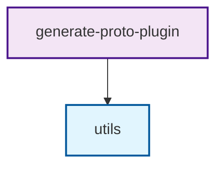
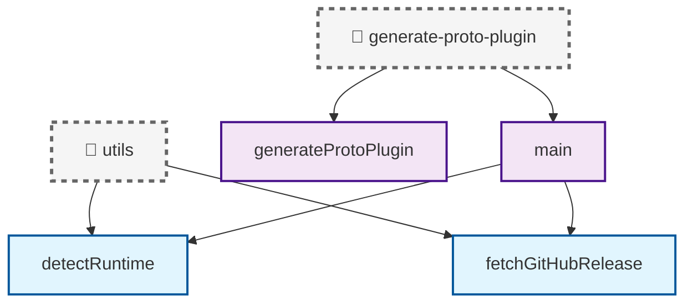

# Danger.js Codebase Analysis

This repository uses [Danger.js](https://danger.systems/js/) to automatically analyze code changes and generate visual diagrams of the codebase structure.

## Features

### 📊 Automatic Individual File Function DAG Generation

When TypeScript files in the `src/` directory are modified in a PR, Danger.js automatically:

1. **Analyzes TypeScript files** to extract:
   - Individual function definitions and exports
   - Import dependencies between files (excluding type-only imports)
   - Function-to-function relationships and call patterns

2. **Generates multiple focused Mermaid diagrams**:
   - **Overview diagram** showing file-level dependencies across the entire codebase
   - **Individual file diagrams** for each non-test file showing:
     - **File container node** with dashed border (📁 file-name)
     - **Functions as colored nodes** within the file
     - **External dependencies** from other files that are imported
     - **Function dependencies** as directed edges from main functions to imported utilities

3. **Creates comprehensive analysis tables** with:
   - All functions defined in each file (deduplicated)
   - Exported symbols and their types
   - File-level dependencies between modules

### 🎨 File Type Classification

Files are automatically categorized and color-coded:

- **🔧 Utility Files** (blue): `utils.ts`, `types.ts` - Core utilities and type definitions
- **⚙️ Generator Files** (purple): Files containing "generate" - Plugin generation scripts
- **🧪 Test Files** (orange): Files containing "test" - Testing and validation scripts
- **📁 Type Files** (green): Other TypeScript files

## Usage

### Automatic PR Analysis

Danger.js runs automatically on every pull request that modifies TypeScript files in `src/`. The generated diagram and analysis will be posted as a comment on the PR.

### Manual Generation

You can also generate the diagram manually:

```bash
# Generate codebase diagram
npm run generate-diagram

# Run Danger.js locally (for testing)
npm run danger:local
```

### Generated Files

- **`CODEBASE_DIAGRAM.md`** - Contains the Mermaid diagram and detailed analysis
- **`dangerfile.js`** - The Danger.js configuration and analysis logic

## Example Output

The generated documentation includes multiple diagrams:

### 1. Overview Diagram (File Dependencies)


### 2. Individual File Diagrams (Function Dependencies)


## Configuration

### Danger.js Configuration

The `dangerfile.js` contains:

- **TypeScript AST parsing** using `@typescript-eslint/typescript-estree`
- **File analysis logic** to extract functions, exports, and imports
- **Mermaid diagram generation** with proper styling and relationships
- **Cross-runtime compatibility** (works with or without Danger context)

### GitHub Workflow

The `.github/workflows/pr.yaml` includes a Danger.js job that:

- Runs on every pull request
- Installs dependencies and runs the analysis
- Posts results as PR comments
- Uses the `GITHUB_TOKEN` for authentication

## Dependencies

- **danger** - Core Danger.js functionality
- **@typescript-eslint/typescript-estree** - TypeScript AST parsing
- **@typescript-eslint/parser** - TypeScript parsing utilities

## Benefits

1. **📈 Enhanced Code Review** - Individual file diagrams help reviewers focus on specific changes without overwhelming complexity
2. **🏗️ Multi-Level Architecture Awareness** - Overview diagram for high-level understanding, detailed diagrams for deep dives
3. **🔍 Focused Impact Analysis** - Each file's diagram shows exactly which external functions it depends on
4. **📚 Modular Documentation** - Separate diagrams for each file make documentation more navigable and maintainable
5. **🚀 Improved Developer Experience** - Developers can quickly understand a specific file's dependencies without cognitive overload
6. **🎯 Targeted Refactoring** - Individual diagrams make it easier to identify refactoring opportunities within specific files
7. **🔒 Runtime Dependency Focus** - Type-only imports are filtered out to show actual runtime dependencies
8. **📊 Scalable Visualization** - Individual diagrams remain readable even as the codebase grows

## Customization

You can customize the analysis by modifying `dangerfile.js`:

- **Add new file types** by updating the classification logic
- **Change colors** by modifying the CSS classes in the Mermaid diagram
- **Add more analysis** by extending the AST walking logic
- **Filter files** by updating the `IGNORE_PATTERNS` array

## Troubleshooting

### Common Issues

1. **Missing dependencies**: Run `npm install` to ensure all packages are installed
2. **TypeScript parsing errors**: Check that files have valid TypeScript syntax
3. **Diagram not generating**: Verify that TypeScript files exist in the `src/` directory

### Debug Mode

To debug the analysis, you can run the script directly:

```bash
node dangerfile.js
```

This will generate the diagram and show detailed console output about the analysis process.
